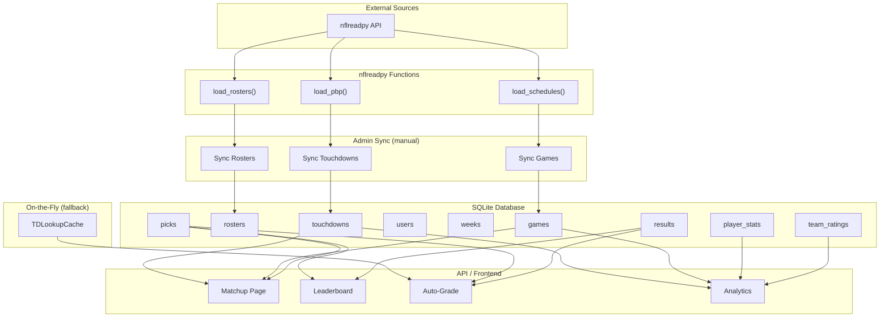
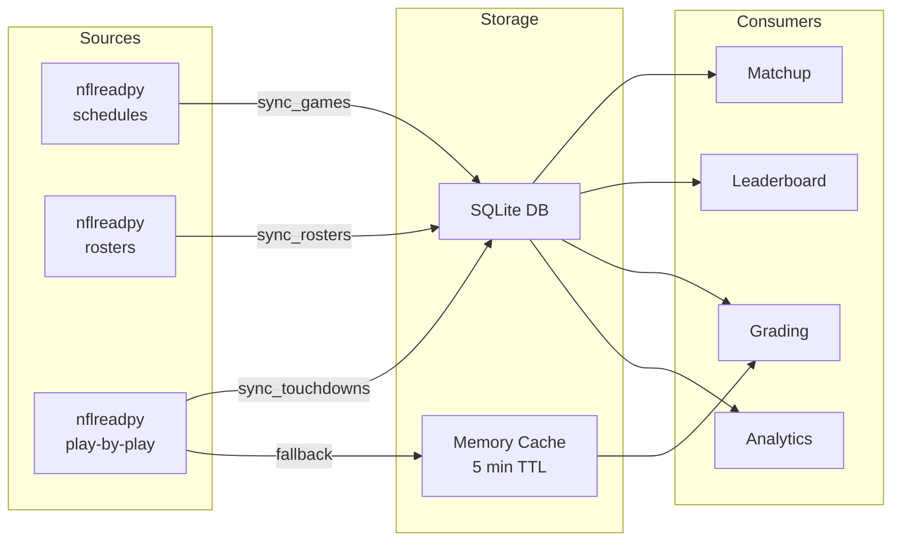
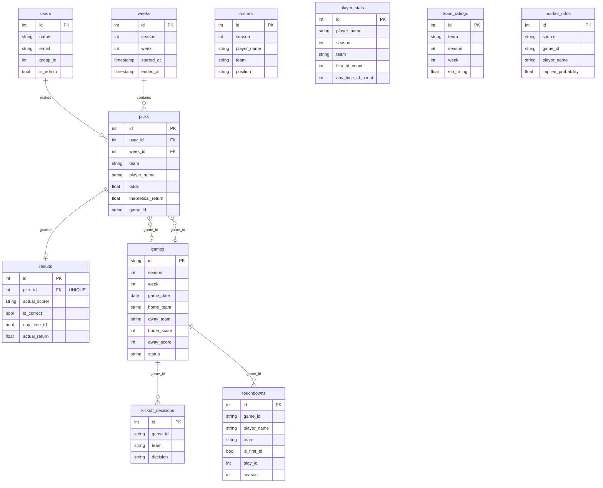
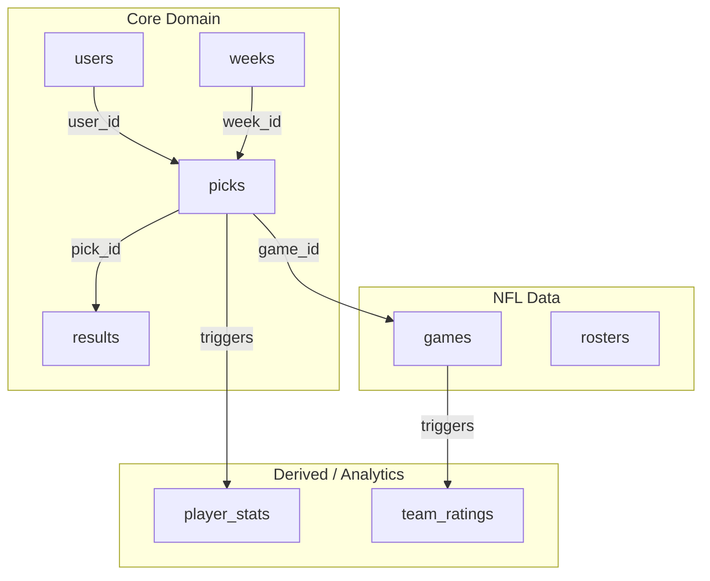
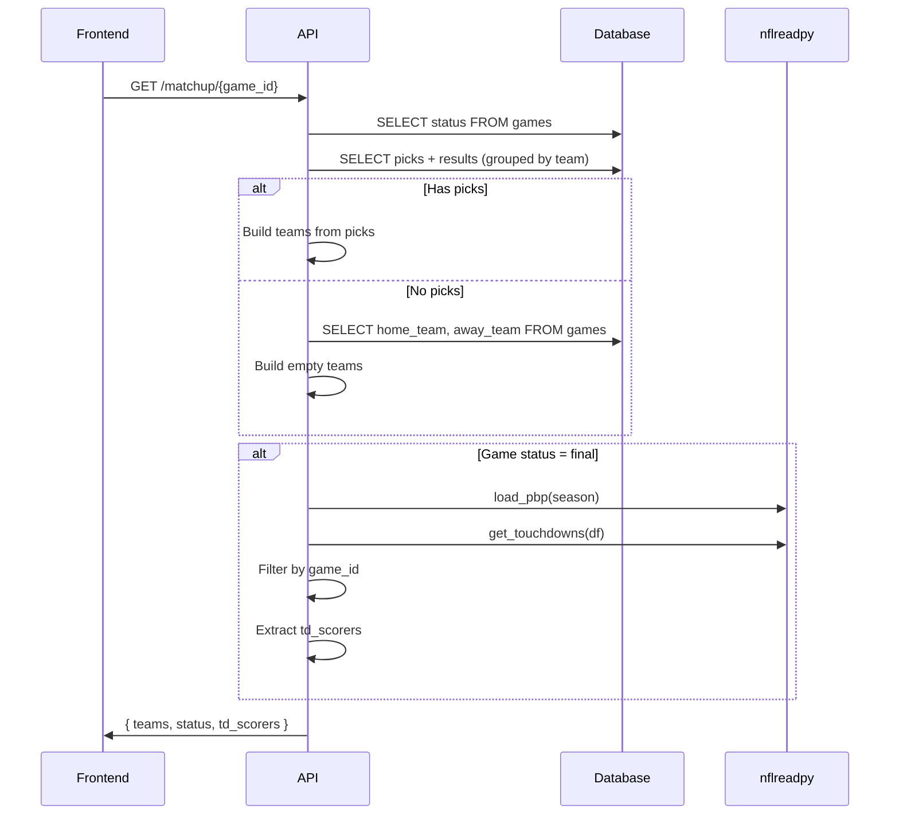
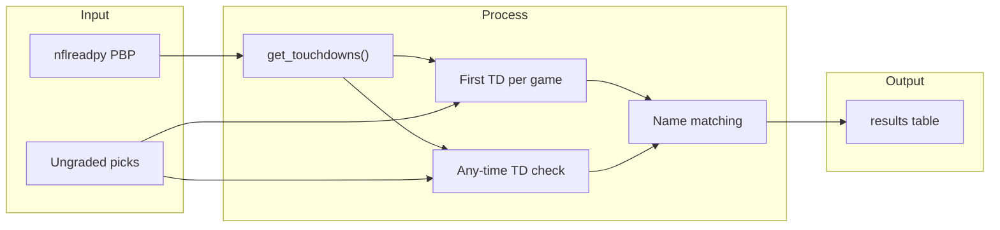

# Fast6 Architecture: Data Flow & Schema

Diagrams use [Mermaid](https://mermaid.js.org/). Render in VS Code, GitHub, or any Mermaid-compatible viewer.

**→ [OPTIMIZATION_ROADMAP.md](./OPTIMIZATION_ROADMAP.md)** – Target architecture & optimization plan

---

## 1. Data Flow

---

## 2. Data Flow (Simplified)

---

## 3. Database Schema (ERD)

---

## 4. Core Tables (Simplified)

---

## 5. Matchup Page Data Flow

---

## 6. Grading Pipeline

---

## Viewing These Diagrams

- **VS Code**: Install "Markdown Preview Mermaid Support" extension
- **GitHub**: Diagrams render automatically in `.md` files
- **Online**: [Mermaid Live Editor](https://mermaid.live/)
