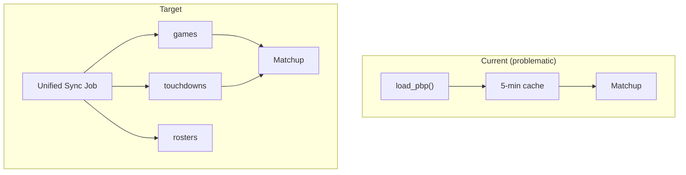
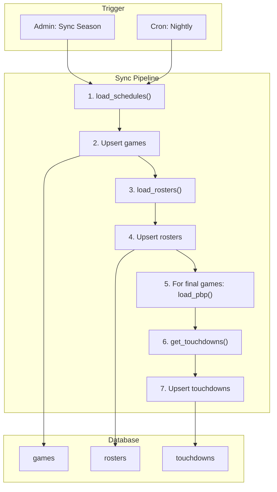
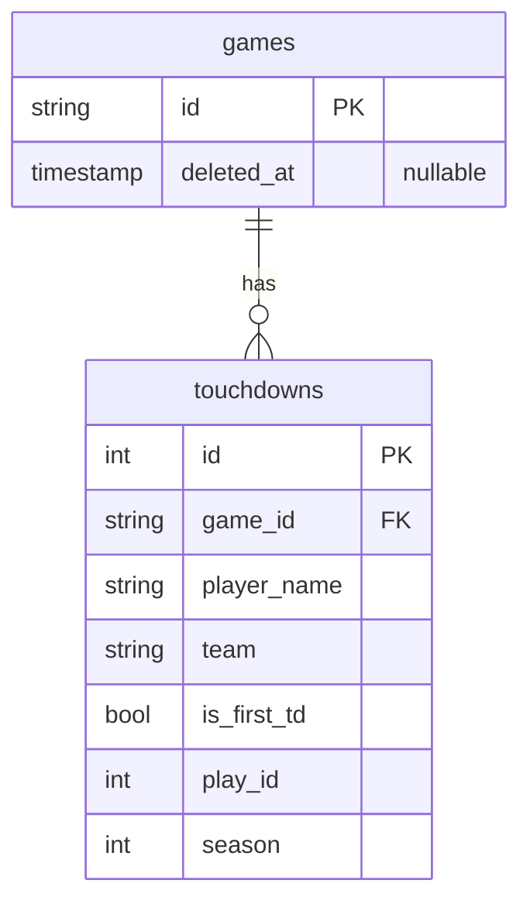

# Fast6 Optimization Roadmap

Best-practice recommendations and architecture evolution for the Fast6 data pipeline and schema.

**Related docs:** [DATA_PIPELINE_REVIEW.md](./DATA_PIPELINE_REVIEW.md) | [ARCHITECTURE_DIAGRAMS.md](./ARCHITECTURE_DIAGRAMS.md)

---

## Implementation Status (latest)

| Item | Status |
|------|--------|
| `touchdowns` table (v17) | Done |
| TD sync for final games | Done – runs after game sync |
| Matchup API reads from DB first | Done – fallback to PBP |
| `td_scorer_team` for return TDs | Done – fixes wrong team on INT/fumble returns |
| `game_id` validation | Done – in td_sync |
| Soft-delete games (v18) | Done – `deleted_at` column |
| `sync_metadata` table | Done |
| Admin `/sync-touchdowns` | Done |
| Health check exposes sync | Done |

---

## Principles

| Principle | Current State | Target |
|-----------|---------------|--------|
| **Single source of truth** | TD data from PBP on-the-fly; games from DB | All persisted data in DB; one sync pipeline |
| **Materialize over compute** | Full season PBP load per matchup TD request | Pre-compute and store TDs when games final |
| **Request scoping** | Load entire season for one game | Load only what's needed (or read from DB) |
| **Idempotent sync** | Sync overwrites; no backfill strategy | Sync is idempotent; backfill script for TDs |
| **Referential integrity** | Orphaned picks after game delete | Soft-delete or FK constraints respected |
| **Observability** | Logging only | Sync metrics, schema_version, data freshness |

---

## Optimization Tiers

### Tier 1: Quick Wins (1–2 days)

**Impact:** High | **Effort:** Low | **Risk:** Low

| # | Change | Rationale |
|---|--------|-----------|
| 1 | Add `touchdowns` table + sync-on-final | Eliminates full-season PBP load for matchup; single source for TDs |
| 2 | Fix `posteam` for return TDs | Correct scorer team (defense vs offense) |
| 3 | Add `game_id` format validation | Fail fast on malformed IDs; avoid silent mismatches |
| 4 | Tie `picks.game_id` to `games.id` | Enforce FK or document intentional loose coupling |

---

### Tier 2: Pipeline Hardening (3–5 days)

**Impact:** High | **Effort:** Medium | **Risk:** Low

| # | Change | Rationale |
|---|--------|-----------|
| 5 | Unified sync job | One entry point: games → rosters → TDs for final games |
| 6 | Soft-delete games | `deleted_at` instead of DELETE; keeps picks valid |
| 7 | `in_progress` status | Use when scores exist but game not final |
| 8 | Schema version + data freshness | Track last sync per table; surface in health check |
| 9 | Sync idempotency | `INSERT OR REPLACE` / upsert patterns; safe to re-run |

---

### Tier 3: Architecture Evolution (1–2 weeks)

**Impact:** High | **Effort:** High | **Risk:** Medium

| # | Change | Rationale |
|---|--------|-----------|
| 10 | Data contract layer | Validate nflreadpy output (columns, types) before use |
| 11 | Background sync worker | Cron/scheduled job; API stays read-only for NFL data |
| 12 | Read replicas / connection pooling | If scale demands; SQLite fine for current load |
| 13 | Event log for grading | Store "TD occurred" events; re-grade by replay |

---

## Target Architecture

### Current → Target Data Flow



### Target Sync Pipeline



### Target Schema Additions



---

## Implementation Details

### 1. `touchdowns` Table

```sql
CREATE TABLE touchdowns (
    id INTEGER PRIMARY KEY AUTOINCREMENT,
    game_id TEXT NOT NULL,
    player_name TEXT NOT NULL,
    team TEXT NOT NULL,
    is_first_td BOOLEAN DEFAULT 0,
    play_id INTEGER,
    season INTEGER NOT NULL,
    created_at TIMESTAMP DEFAULT CURRENT_TIMESTAMP,
    FOREIGN KEY (game_id) REFERENCES games(id),
    UNIQUE(game_id, play_id)
);
CREATE INDEX idx_touchdowns_game ON touchdowns(game_id);
CREATE INDEX idx_touchdowns_season ON touchdowns(season);
```

**Populate:** During sync, after games updated: for each `status = 'final'` game, derive TDs from PBP and upsert.

### 2. Soft-Delete Games

```sql
-- Migration: add column
ALTER TABLE games ADD COLUMN deleted_at TIMESTAMP DEFAULT NULL;

-- Application: "delete" = soft delete
UPDATE games SET deleted_at = CURRENT_TIMESTAMP, status = 'deleted' WHERE id = ?;

-- Queries: filter out deleted
SELECT * FROM games WHERE deleted_at IS NULL;
```

### 3. Sync Job Pseudocode

```python
def sync_season(season: int) -> SyncResult:
    # 1. Games
    schedule = nfl.load_schedules(seasons=[season])
    for row in schedule.iterrows():
        upsert_game(row)
    
    # 2. Rosters
    rosters = nfl.load_rosters(seasons=[season])
    for row in rosters.iterrows():
        upsert_roster(row)
    
    # 3. TDs for final games only
    final_games = get_final_games(season)
    if final_games:
        pbp = nfl.load_pbp(seasons=[season])
        tds = get_touchdowns(pbp)
        for game_id in final_games:
            game_tds = tds[tds.game_id == game_id]
            upsert_touchdowns(game_id, game_tds)
    
    return SyncResult(inserted=..., updated=..., errors=...)
```

### 4. Matchup API After Optimization

```python
# Before: load_pbp(season) + get_touchdowns() + filter
# After:
cursor.execute(
    "SELECT player_name, team FROM touchdowns WHERE game_id = ? ORDER BY play_id",
    (game_id,)
)
td_scorers = [{"player_name": r[0], "team": r[1]} for r in cursor.fetchall()]
```

---

## Caching Strategy

| Layer | Current | Recommended |
|-------|---------|-------------|
| **PBP** | 5-min TTL, full season | Eliminate for matchup; use only in sync + grading |
| **Grading** | TDLookupCache (1 hr) | Keep; or read from `touchdowns` |
| **API responses** | None | Add HTTP cache (`Cache-Control: max-age=60`) for matchup, leaderboard |
| **Frontend** | Varies | SWR/React Query with stale-while-revalidate |

---

## Data Freshness

Track sync timing for debugging and health:

```sql
CREATE TABLE sync_metadata (
    target TEXT PRIMARY KEY,  -- 'games', 'rosters', 'touchdowns'
    season INTEGER,
    last_sync_at TIMESTAMP,
    rows_affected INTEGER,
    status TEXT  -- 'success', 'partial', 'error'
);
```

Health check: `GET /health` returns `sync_metadata`; alert if `last_sync_at` > 24h.

---

## Migration Order

1. Add `touchdowns` table migration
2. Implement TD sync in game_sync (or new sync_touchdowns)
3. Update matchup API to read from `touchdowns` (fallback to on-the-fly if empty)
4. Backfill `touchdowns` for existing final games
5. Remove on-the-fly TD path from matchup API
6. Add `deleted_at` to games; change cleanup to soft-delete
7. Unify sync into single job
8. Add `sync_metadata` and health check

---

## Risk Mitigation

| Risk | Mitigation |
|------|------------|
| TD sync logic differs from grading | Reuse `get_touchdowns()`; same code path |
| Backfill fails for some games | Log failures; manual inspection; retry |
| Sync overwrites good data with bad | Idempotent upsert; consider `updated_at` to detect overwrites |
| Performance regression | Benchmark matchup endpoint before/after |
| Breaking existing clients | API response shape unchanged; additive only |

---

## Success Metrics

| Metric | Before | Target |
|--------|--------|--------|
| Matchup page (final game) latency | ~2–5s (PBP load) | &lt;200ms |
| PBP loads per hour | N × matchup views | 0 (read path) |
| Orphaned picks after cleanup | Yes | No (soft-delete) |
| TD scorer accuracy | Bug (return TDs) | Correct |
| Data freshness visibility | None | Health check |

---

## References

- [DATA_PIPELINE_REVIEW.md](./DATA_PIPELINE_REVIEW.md) – Issues and recommendations
- [ARCHITECTURE_DIAGRAMS.md](./ARCHITECTURE_DIAGRAMS.md) – Current diagrams
- [AGENTS.md](../AGENTS.md) – Project conventions
